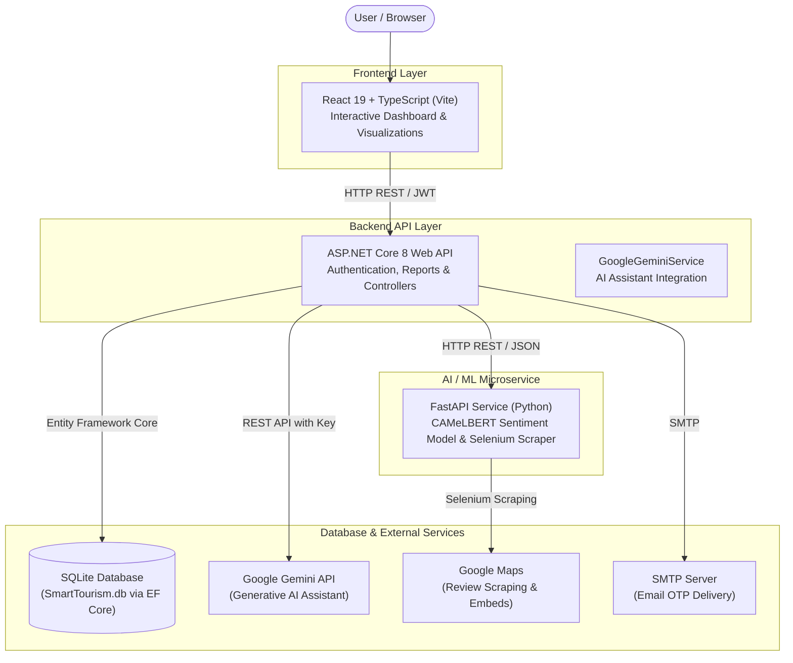

<h1 align="center">Touralyze</h1>

<p align="center">
  
  
  
  
  
</p>

Touralyze is a smart tourism sentiment analysis platform designed to analyze Arabic tourism reviews and provide meaningful insights through sentiment analysis and interactive visualizations.

---

## Overview

The tourism and hospitality sector relies heavily on customer feedback to evaluate destination appeal, service quality, and visitor satisfaction. However, analyzing thousands of unstructured Arabic reviews across diverse regional and colloquial dialects presents a notable challenge for destination managers, researchers, and tourism authorities.

**Touralyze** solves this problem by delivering an end-to-end analytical solution customized for Arabic tourism content. The platform gathers tourist feedback from Google Maps, processes colloquial expressions using a fine-tuned Arabic transformer model, classifies sentiment polarities, and visualizes key metrics through an interactive bilingual dashboard.

---

## Key Features

- **Arabic Sentiment Analysis**: Evaluates Arabic tourism reviews using fine-tuned transformer models tailored for Saudi dialect nuances.
- **Positive / Neutral / Negative Classification**: Categorizes feedback into three distinct emotional polarities alongside statistical confidence scores.
- **Tourism Review Analysis**: Extracts key topics, calculates average ratings, and computes sentiment proportions across visitor reviews.
- **Interactive Dashboard**: Features a 3-level hierarchical navigation tree (Region &rarr; City &rarr; Report) covering the 13 administrative regions of Saudi Arabia.
- **Charts & Visualizations**:
  - Sentiment distribution breakdown via Recharts (Donut and Bar charts).
  - High-frequency keyword extraction displayed as a dynamic D3.js word cloud.
  - Interactive review explorer with sentiment-based filtering.
- **Google Maps Integration**:
  - Automated review ingestion via Selenium WebDriver.
  - Interactive destination map embeds directly inside generated reports.
- **Authentication & Authorization**:
  - Secure user registration and login powered by ASP.NET Core JWT Bearer authentication.
  - Password hashing utilizing BCrypt.
- **OTP Verification**:
  - Time-limited (5-minute) 6-digit OTP delivery via email for account registration and password recovery.
- **Arabic and English Interface**:
  - Full bilingual localization with persistent language selection.
  - Automatic RTL (Right-to-Left) and LTR (Left-to-Right) layout adaptation.
- **Report Management**:
  - Deterministic report generation with SHA256-based deduplication caching.
  - Comprehensive, printable report views with statistical summaries.
- **Gemini Integration**:
  - Integrated AI tourism advisor powered by Google Gemini.
  - Generates analytical summaries from destination statistics and answers custom queries.
  - Resilient multi-model fallback chain (`gemini-2.0-flash`, `gemini-2.0-flash-lite`, `gemini-2.5-flash`) with automatic retry and backoff handling.

---

## Screenshots

<!-- Add screenshots to docs/screenshots/ and reference them here, e.g.:


-->

---

## Tech Stack

### Frontend
- **Framework**: React 19
- **Language**: TypeScript
- **Build Tool**: Vite 6
- **Routing**: React Router DOM (HashRouter)
- **Data Visualization**: Recharts, D3.js
- **Icons**: Lucide React
- **Styling**: Tailwind CSS & Vanilla CSS

### Backend
- **Framework**: ASP.NET Core 8 Web API
- **Language**: C# (.NET 8)
- **Data Access**: Entity Framework Core 8
- **Authentication**: JWT Bearer (`Microsoft.AspNetCore.Authentication.JwtBearer`)
- **Security**: BCrypt.Net-Next
- **API Documentation**: Swagger / OpenAPI (Swashbuckle)

### AI / Machine Learning
- **Sentiment Model**: Fine-tuned CAMeLBERT (`whrivt/camelbert-saudi-gmaps-sentiment`) for Saudi dialect Arabic reviews
- **Frameworks**: PyTorch, Hugging Face Transformers
- **API Service**: FastAPI & Uvicorn (Python 3.10+)
- **Text Preprocessing**: 5-stage Arabic normalization pipeline (diacritics removal, tatweel stripping, dialect letter unification)
- **Generative AI**: Google Gemini REST API (`GoogleGeminiService`)

### Database
- **Database**: SQLite (`SmartTourism.db`) with Entity Framework Core SQLite Provider

### External Services
- **Google Maps**: Review extraction via Selenium WebDriver and embedded destination maps
- **Google Gemini API**: AI-powered report insights and conversational assistant
- **SMTP Email Service**: Delivery of 6-digit verification and password-reset OTP codes

---

## Project Architecture



---

## Project Structure

```text
sentiment-analysis/
├── index.html                   # HTML entrypoint
├── package.json                 # Frontend dependencies and scripts
├── vite.config.ts               # Vite configuration
├── public/                      # Static assets (logo)
├── src/
│   ├── App.tsx                  # Root application layout, pages, and routes
│   ├── index.tsx                # React bootstrap
│   ├── index.css                # Global styles
│   ├── components/              # Shared UI components (LanguageSwitcher, ReportAIChat)
│   ├── context/                 # State providers (AuthContext, LanguageContext)
│   ├── pages/                   # Application pages (Settings)
│   ├── services/                # API integration services (reportApi, aiChatService)
│   ├── translations/            # Bilingual translation dictionaries (ar.ts, en.ts)
│   ├── types.ts                 # TypeScript type definitions and data contracts
│   └── utils/                   # Geographic mapping utilities (regionMapping.ts)
├── SmartTourism.API/            # ASP.NET Core 8 Web API
│   ├── Controllers/             # API Controllers (AiController, AuthController, ReportsController)
│   ├── Data/                    # AppDbContext and database configurations
│   ├── DTOs/                    # Data Transfer Objects
│   ├── Migrations/              # EF Core migrations
│   ├── Models/                  # Entity models (User, Report, Review)
│   ├── Services/                # Core services (GoogleGeminiService, EmailService)
│   ├── Program.cs               # Service registration and middleware pipeline
│   └── appsettings.json         # Base configuration (secrets excluded)
└── SmartTourism.ML/             # Python ML Sentiment Microservice
    ├── main.py                  # FastAPI application & CAMeLBERT inference pipeline
    └── requirements.txt         # Python dependencies
```

---

## Getting Started

### Prerequisites

Ensure you have the following installed on your system:
- **Node.js**: v18.0.0 or higher
- **npm**: v9.0.0 or higher
- **.NET SDK**: v8.0 or higher
- **Python**: v3.10 or higher
- **Google Chrome**: Required for Selenium headless browser review scraping

### Installation

1. **Clone the repository:**
   ```bash
   git clone https://github.com/lq-p3/sentiment-analysis.git
   cd sentiment-analysis
   ```

2. **Install frontend dependencies:**
   ```bash
   npm install
   ```

3. **Set up the Python ML microservice:**
   ```bash
   cd SmartTourism.ML
   python3 -m venv venv
   source venv/bin/activate       # On Windows: venv\Scripts\activate
   pip install -r requirements.txt
   cd ..
   ```

4. **Restore backend dependencies:**
   ```bash
   cd SmartTourism.API
   dotnet restore
   cd ..
   ```

---

## Configuration

> [!IMPORTANT]
> Secrets, API keys, and sensitive tokens must **NEVER** be stored in `appsettings.json` or committed to source control.

### Local Development (.NET User Secrets)

For local development in ASP.NET Core, use the [.NET Secret Manager](https://learn.microsoft.com/en-us/aspnet/core/security/app-secrets) to keep sensitive keys outside the project tree:

```bash
cd SmartTourism.API

# Configure your Google Gemini API key
dotnet user-secrets set "GeminiApiKey" "<YOUR_GEMINI_API_KEY>"

# Configure your JWT signing key
dotnet user-secrets set "JwtSettings:Key" "<YOUR_SECURE_JWT_SECRET>"
```

### Production Configuration

In staging or production environments, supply sensitive configurations via environment variables:

- `GeminiApiKey`: Your production Google Gemini API key.
- `JwtSettings__Key` (or `JwtSettings:Key`): Your production JWT signing secret.

---

## Running the Application

To run the complete platform, start each of the three services:

### 1. Start the Python ML Service
```bash
cd SmartTourism.ML
source venv/bin/activate       # On Windows: venv\Scripts\activate
uvicorn main:app --host 127.0.0.1 --port 8000 --reload
```
*The ML service will be listening on `http://127.0.0.1:8000`.*

### 2. Start the ASP.NET Core Backend
```bash
cd SmartTourism.API
dotnet run
```
*The API will start at `http://localhost:5165` (Swagger UI accessible at `http://localhost:5165/swagger`).*

### 3. Start the Frontend Development Server
```bash
npm run dev
```
*The React application will be available at `http://localhost:5173`.*

---

## Security

- **Credential Isolation**: All API keys, tokens, and cryptographic secrets are strictly excluded from source control.
- **Externalized Secret Management**: The backend is designed to consume sensitive configurations through .NET User Secrets during local development and environment variables in production.
- **Ignored Database Files**: Local SQLite database files (`*.db`, `*.db-shm`, `*.db-wal`) are excluded via `.gitignore` to prevent committing runtime application data.
- **Stateless Authentication**: Access control relies on signed JSON Web Tokens (JWT) using HMAC validation, combined with BCrypt hashing for user credentials.

---

## Future Improvements

- Add streaming response support for real-time interaction with the Gemini AI assistant.
- Extend sentiment classification to additional regional Arabic dialect datasets.
- Support direct export of generated sentiment reports to PDF and CSV formats.
- Provide a unified Docker Compose configuration for multi-container deployment.

---

## Author

**Ali Alqahtani** — [GitHub](https://github.com/lq-p3) · [LinkedIn](https://www.linkedin.com/in/ali-alqahtani-2a8297333)

---

## License

This project is licensed under the [MIT License](LICENSE).
